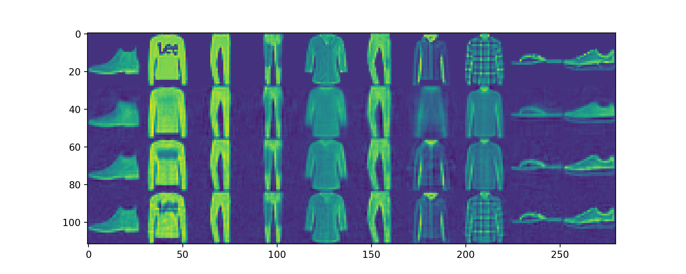

# Task 2 Observations

## 2a 
What do you observe from the results? Give your comments.

Here are the printed PSNR values for P = 10, 50, and 200:

```
'when P =', 10, 'PSNR =', 19.41605461896483
'when P =', 50, 'PSNR =', 22.35987241270472
'when P =', 200, 'PSNR =', 25.73923658049879
```

Since PSNR is a log function of the maximum pixel intensity value for greyscale images divided by MSE, and the numerator is fixed at 1.0, PSNR grows when MSE shrinks. Thus PSNR is greater when the loss in the decompressed image is smaller and vice versa.

## 2b
In one figure, display the first 10 test images and their decompressed images with P = 10, 50, and 200 in four rows: (a) the original 10 images, (b) the corresponding decompressed images with P = 10, (c) the decompressed images with P = 50, and (d) the decompressed images with P = 200.



What do you observe from the decompressed images (the visual quality of the decompressed images of different P values)? With the same P value, which kind of images do you think are more difficult to decompress, and why?

From the decompressed images for different P values, we can see that as P value increases, the visual quality of decompressed images increases. 

For example, from the second original image (long-sleeved shirt with the type "Lee") we can recognize the type with letters "Lee". 

- In P = 10, the type is invisible, and we cannot really discern the dark-colored pixels from the base color of the shirt with the naked eye. 

- In P = 50, we can tell there is a dark-colored section in the middle, but still cannot discern the letters.

- In P = 200, the letters are still blurry, but with naked eye we can tell they are letters. 

We observe that images of items with intricate patterns (e.g. plaid, letter types, patches of highly contrasting colors with the base color) and shoes are more difficult to decompress than other kinds of fashion items. This is because patterns and shoes are consisted of pixels with high rates of change and gradient descent update weights that minimized for the min . So when P is smaller, these pixels are weighted less and aren't preserved well.
